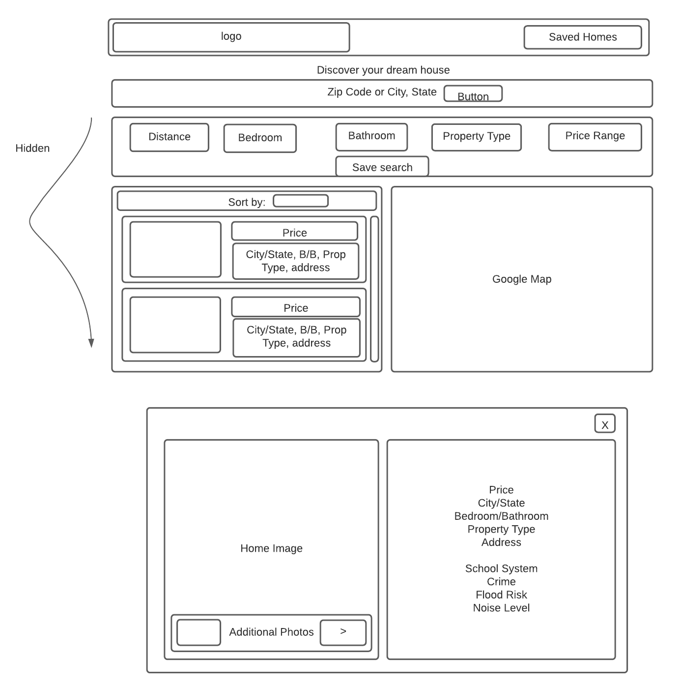
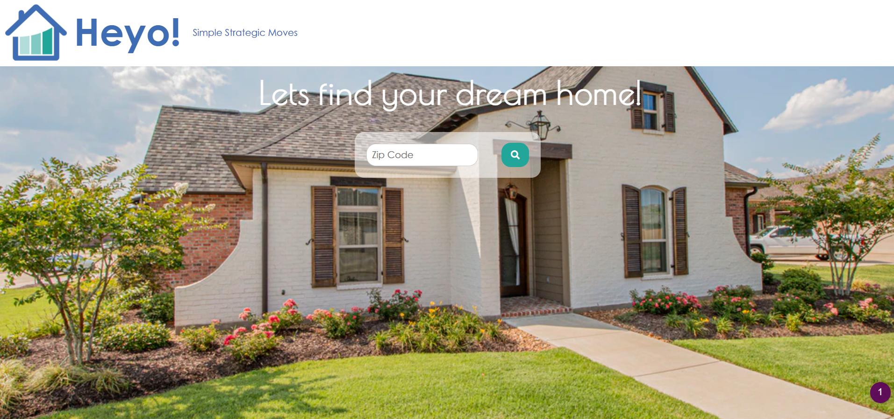
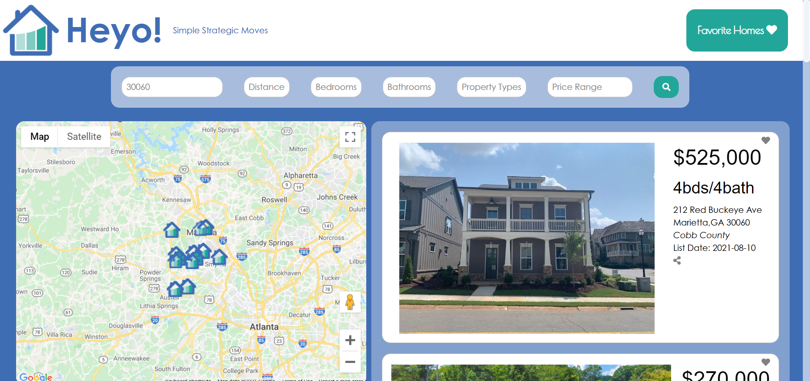
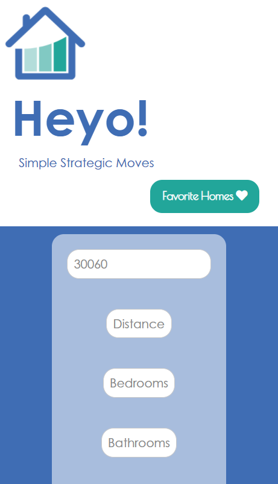
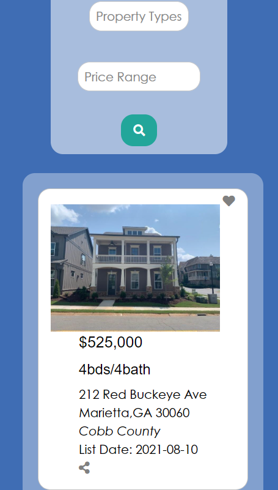

# Heyo-Simple-Strategic-Moves

Georgia Tech Coding Boot Camp Project #1

<ins> **Deployed Application:**</ins> https://oskwalker.github.io/Heyo-Simple-Strategic-Moves/

**An intuitive and easy to use application that helps home buyers search for listings in their area by their critera and plots them on the map so they can organize their search**

<ins> **Objective:** </ins> The goal of this group project was to utilize all the skills we have previously learned in this course so far including HTML/CSS, Javascript, Git, APIs(Web, third-party, and server side). 

# User Story: 

**AS A busy professional new to the city**

**I WANT to know which homes are close by **

**SO THAT I can decide how to plan my home viewing process**

# Acceptance Criteria:

GIVEN a real estate web page

WHEN I search for a zip code

THEN I am presented with homes for sale within that zip code

WHEN I don't have a valid zip code

THEN I am prompted to input a valid zip code

WHEN I view the map

THEN I am presented with icons for the location of each of the listed homes

WHEN I hover over the home on the map

THEN I am given information about the listing on hover

WHEN I click the heart icon on the listing

THEN I can see that I have it favorited

WHEN I scroll to view the listing

THEN the map stays where it is 

WHEN I have no favorites saved

THEN I am alerted that I have no favorites saved

WHEN a listing doesn't have an image

THEN a default image is shown

# Roles:

**Front-end:**
* Hannah McDonald
* Yesica Tejada
* Darrell Carter

**Back-end:**
* Erica Baity
* Omar Walker
* Darrell Carter

# Technologies:

* Semantic UI - Frontend
* Foundation- Frontend
* Adobe Fonts- Frontend
* Javascript/jQuery - Backend
* Google Maps API - Map display
* Zipcodebase Zip Code Search API - Zipcode latitude and longitude filter
* US Real Estate API - US MLS Listings

# Wireframe:

First, we made a wireframe to visualize our goals for this site and how we wanted it to look.

# Screenshots:

<ins> **Plans for future development:** </ins>
* Clean-up site responsiveness & add map support to mobile site
* Google map directions and route planning
* Crowdfunding feature for home purchase
* Enable property filtering 
* Make map more interactive
* Property/listing texting feature
* Organizing favorites
* User account creation
* Enhance property results (eg. school system, crime rates, traffic, mortgage info)

  
# Installation:

N/A

<ins>Built with:</ins> Gitbash, Github, VS Code + VS Code Live Server Extension 

